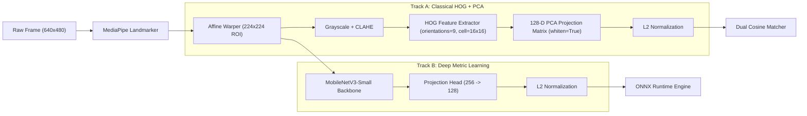
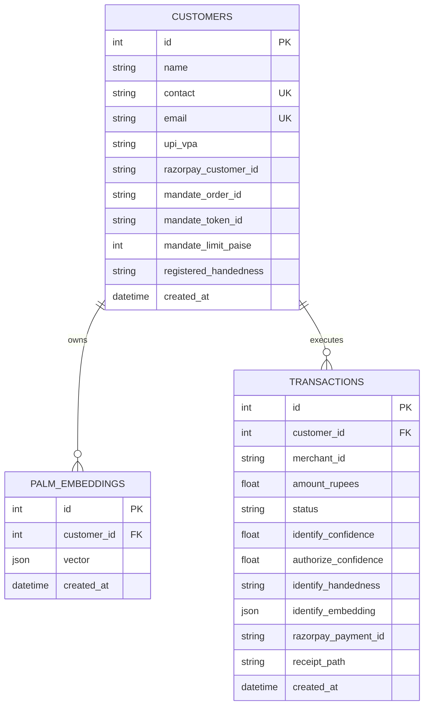

# PalmPay — Biometric Micro-Payment Terminal

> An RBI-compliant touchless palm-vein biometric autopay system featuring dual-scan payment authorization, real-time MediaPipe hand landmarking, tissue/multi-frame liveness verification, HOG+PCA & MobileNetV3 metric learning, Razorpay UPI Autopay mandate integration, and PDF transaction receipt generation.

---

## 📋 Overview

**PalmPay** is an end-to-end biometric payment terminal designed for seamless, contact-free micro-payments. It eliminates physical cards, mobile phones, QR code scanning, passwords, and cash by allowing customers to authorize transactions using their palm print.

### Problem Solved
Traditional payment methods at physical POS/kiosk terminals require physical touch (card inserts, PIN pads, phone scanning) or additional hardware. Existing biometric systems often suffer from:
- Vulnerability to static paper photo prints or digital screen presentation attacks.
- High false acceptance rates (FAR) and false rejection rates (FRR) under varied ambient lighting.
- Lack of regulatory compliance with micro-payment auto-debit caps.

### Technical Solution
PalmPay solves these challenges through a multi-layered biometric pipeline:
- **MediaPipe Hand Landmarker**: Tracks 21 3D hand keypoints in real time to enforce open-palm posture and compute deterministic 2D cross-product chirality (Left vs. Right hand discrimination).
- **Anti-Spoofing & Liveness Layer**: Combines Laplacian high-frequency variance, color channel distribution analysis, and multi-frame parallax micro-motion checks to block spoofs (printed photos or frozen video streams).
- **Dual Matching Engines**:
  - *Track A (Classical Baseline)*: Grayscale conversion → CLAHE (Contrast Limited Adaptive Histogram Equalization) → HOG (Histogram of Oriented Gradients) texture extraction → 128-D PCA projection.
  - *Track B (Deep Metric Learning)*: Fine-tuned MobileNetV3-Small neural network trained with SimCLR (NT-Xent contrastive loss) producing 128-D L2-normalized feature vectors, exportable to ONNX Runtime for edge deployment.
- **Two-Scan Transaction Workflow**: Session identity locking ensures that the palm presented during payment authorization (Scan 2) strictly matches the customer identified during Scan 1.
- **Razorpay UPI Autopay Mandate Client**: Automates customer creation, mandate order creation, and recurring token charges (capped at ₹100 per RBI micro-payment guidelines).
- **Automated PDF Receipts**: Generates downloadable ReportLab PDF transaction certificates upon authorization.

---

## ✨ Key Features

* **🖐 Open-Palm Posture & Chirality Verification**: Validates fully extended fingers and computes 2D cross-product chirality to enforce strict handedness alignment.
* **🫀 Multi-Layer Anti-Spoofing Liveness**: Evaluates tissue skin variance, Laplacian sharpness, and multi-frame parallax micro-motion across video bursts.
* **🔒 Biometric Deduplication**: Prevents duplicate palm enrollments by screening new palm embeddings against enrolled templates.
* **💳 Two-Scan Transaction Flow**:
  1. *Scan 1 (Identify)*: Identifies the customer and initializes a payment session.
  2. *Set Amount*: Configures payment amount (capped at ₹100).
  3. *Scan 2 (Authorize)*: Verifies customer identity, handedness, and inter-scan cosine similarity before triggering tokenized payment.
* **⚡ One-Touch Fallback Authorization**: Passwordless secondary verification for borderline biometric confidence scores.
* **💳 Razorpay UPI Autopay Mandate Integration**: Handles customer creation, mandate orders, tokenized recurring charges, and HMAC SHA256 webhook signature validation.
* **📄 Automated PDF Receipt Generation**: Generates styled PDF transaction receipts stored locally and downloadable via endpoint links.
* **🎥 Interactive Kiosk UI**: Built-in glassmorphism frontend (`frontend/test.html`) hosted directly via FastAPI with live HTML5 webcam controls.
* **📡 WebSocket Relay Hub & Edge Capture Client**: Supports streaming live preview feeds from Raspberry Pi edge hardware (`scripts/pi_capture_client.py`) to the backend server via WebSockets.
* **📊 Biometric Evaluation Suite**: Includes `evaluate.py` to calculate FAR, FRR, EER, and plot ROC and DET curves.

---

## 🏗 System Architecture

```mermaid
flowchart TD
    subgraph Client / Edge Layer
        UI["Kiosk Frontend / Web App (test.html)"]
        Pi["Raspberry Pi Capture Client (pi_capture_client.py)"]
    end

    subgraph API & Gateway Layer (FastAPI)
        Endpoint["FastAPI REST Endpoints & WS Relay Hub"]
        CORS["CORS & Request Validation"]
    end

    subgraph Biometric & ML Pipeline
        MP["MediaPipe HandLandmarker (21 Keypoints)"]
        Liveness["Liveness Check (Laplacian + Color + Multi-frame Parallax)"]
        Align["ROI Alignment & Normalization (224x224)"]
        Embedder["Palm Embedder (HOG + 128-D PCA / MobileNetV3)"]
        Matcher["Dual-Threshold Matcher (High: 0.82, Low: 0.70)"]
    end

    subgraph Storage & Payment Layer
        DB[("SQLite Database (palmpay.db)")]
        RP["Razorpay Mandate Gateway Client"]
        Receipt["ReportLab PDF Generator"]
    end

    UI -->|"HTTP POST / WebSocket"| Endpoint
    Pi -->|"Direct POST / WS Stream"| Endpoint
    Endpoint --> CORS
    CORS --> MP
    MP --> Liveness
    Liveness --> Align
    Align --> Embedder
    Embedder --> Matcher
    Matcher <--> DB
    Matcher --> RP
    RP --> DB
    Endpoint --> Receipt
    Receipt --> DB
```

### Component Breakdown
1. **Frontend Kiosk (`frontend/test.html`)**: Single-page application providing video capture, posture guides, multi-frame burst enrollment, two-scan payment execution, transaction ledgers, and PDF receipt downloads.
2. **FastAPI Server (`backend/main.py`)**: Handles REST endpoints, WebSocket relay rooms, session state management, database connections, and static frontend hosting.
3. **Palm Detection & Alignment (`backend/palm/detector.py`)**: Uses MediaPipe to locate landmarks, calculate hand chirality via cross-product, run tissue liveness analysis, check finger posture, and warp the palm region into a canonical 224x224 ROI.
4. **Embedding Generator (`backend/palm/embedder.py`)**: Applies CLAHE enhancement, extracts HOG descriptors, projects features into 128 dimensions via PCA, and L2-normalizes vector output.
5. **Dual Matcher (`backend/palm/matcher.py`)**: Thread-safe vector index evaluating cosine similarity against configured thresholds (`MATCH_THRESHOLD_HIGH=0.82`, `MATCH_THRESHOLD_LOW=0.70`).
6. **Payment Engine (`backend/payments/razorpay_client.py`)**: Integrates Razorpay API for customer creation, mandate orders, recurring token debits, and HMAC-SHA256 webhook validation with fallback mocking for sandbox/test environments.
7. **Receipt Generator (`backend/receipt.py`)**: Uses ReportLab to generate PDF transaction certificates with masked UPI handles and payment details.

---

## 🛠 Tech Stack

| Category | Technology | Purpose |
| :--- | :--- | :--- |
| **Language** | Python 3.10+ | Core backend API, biometric processing, and ML training |
| **Web Backend** | FastAPI, Uvicorn, WebSockets | Asynchronous REST API server and real-time WebSocket relay hub |
| **Database & ORM** | SQLite, SQLAlchemy | Persistent storage for customer profiles, embeddings, and transactions |
| **Computer Vision** | OpenCV, MediaPipe | Real-time hand landmark tracking, posture guide, affine warping, CLAHE |
| **Feature Extraction** | scikit-image (`hog`), scikit-learn (`PCA`) | Grayscale CLAHE enhancement, HOG texture descriptor, 128-D PCA projection |
| **Deep Learning** | PyTorch, torchvision, ONNX Runtime | MobileNetV3-Small metric network, SimCLR contrastive training, ONNX export |
| **Payment Gateway** | Razorpay SDK, HMAC-SHA256 | UPI Autopay mandate order registration, token recurring charges, webhooks |
| **Receipt Generation**| ReportLab | Automated PDF certificate generation with transaction details |
| **Frontend UI** | HTML5, Vanilla JavaScript, CSS3 | Kiosk interface with live camera feed, tab navigation, and receipt links |
| **Testing Suite** | FastAPI TestClient, NumPy | End-to-end integration testing and synthetic data generation |

---

## 📁 Project Structure

```text
palmmpayy/
├── backend/
│   ├── palm/
│   │   ├── augment.py          # Palm image spatial & intensity augmentation variants
│   │   ├── detector.py         # MediaPipe landmarker, chirality, liveness & ROI alignment
│   │   ├── embedder.py         # HOG + PCA 128-D feature extraction pipeline
│   │   └── matcher.py          # Thread-safe dual-threshold cosine similarity matcher
│   ├── payments/
│   │   └── razorpay_client.py  # Razorpay UPI Autopay SDK client & mock fallback
│   ├── database.py             # SQLAlchemy engine & session setup (sqlite:///./palmpay.db)
│   ├── main.py                 # FastAPI application routes, WS relay, session state
│   ├── models.py               # SQLAlchemy ORM models (Customer, PalmEmbedding, Transaction)
│   ├── receipt.py              # ReportLab PDF receipt generator & UPI VPA masking
│   └── schemas.py              # Pydantic request/response validation schemas
├── frontend/
│   └── test.html               # Kiosk UI with webcam integration, enrollment & ledger
├── receipts/                   # Directory where output PDF receipt certificates are saved
├── scripts/
│   ├── copy_assets.py          # Asset copier utility for pretrained model artifacts
│   ├── list_customers.py       # CLI utility to list enrolled customers and mandate status
│   ├── pi_capture_client.py    # Raspberry Pi camera capture client (Direct POST & WS Relay)
│   └── test_end_to_end.py      # E2E integration test suite for REST API workflows
├── evaluate.py                 # Biometric evaluation script (FAR, FRR, EER, ROC/DET plots)
├── fit_pca.py                  # PCA fitting script for HOG feature projection matrix
├── train_classical.py          # Benchmark runner for classical feature extraction
├── train_deep.py               # MobileNetV3 SimCLR deep metric learning training script
├── hand_landmarker.task        # MediaPipe HandLandmarker binary model file
├── pca.joblib                  # Fitted 128-D PCA projection matrix weights
├── mobilenet_v3_palm.pth       # PyTorch checkpoint for fine-tuned MobileNetV3 model
├── requirements.txt            # Python dependencies
├── .env.example                # Template for environment configuration
└── README.md                   # Project documentation
```

---

## 🔄 How It Works

### 1. Customer Enrollment Flow
1. User enters name, 10-digit mobile number, email, and UPI VPA (`name@bank`) on the kiosk screen.
2. The user holds their open palm inside the camera posture guide.
3. The camera grabs 3 consecutive video frames.
4. `PalmDetector` performs:
   - MediaPipe 21-point hand landmarking.
   - Open-palm posture check (`is_open_palm`).
   - Tissue & texture liveness check (`verify_liveness`).
   - Multi-frame parallax motion check (`verify_multiframe_liveness`).
   - Hand chirality determination via 2D cross-product (`determine_handedness`).
5. Images are aligned into canonical 224x224 ROIs and top-up augmented if needed.
6. Embeddings are extracted via `PalmEmbedder` (128-D vector).
7. **Biometric Deduplication**: `PalmMatcher` screens the embedding against existing enrolled palms to reject duplicate registrations.
8. Customer record, embeddings, and Razorpay UPI Autopay mandate order are stored in `palmpay.db`.

### 2. Two-Scan Payment Authorization Flow
1. **Scan 1 (Identify)**:
   - Customer holds palm in front of sensor.
   - System captures frame, extracts embedding, and queries `PalmMatcher`.
   - On match (`confidence >= 0.82`), a new session is created in state `IDENTIFIED`.
2. **Set Amount**:
   - Merchant/Kiosk sets transaction amount (max ₹100).
   - Session transitions to state `AMOUNT_SET`.
3. **Scan 2 (Authorize)**:
   - Customer holds palm in front of sensor again to confirm payment.
   - System runs 3-way security verification:
     - **Chirality Lock**: Verifies scan 2 hand matches scan 1 registered handedness.
     - **Customer Lock**: Ensures scan 2 hand belongs to the same customer ID.
     - **Session Cosine Similarity**: Verifies scan 1 embedding vs scan 2 embedding similarity >= 0.68.
   - If score is high (`>= 0.82`), transaction transitions to `PAID`.
   - If score is borderline (`0.70 <= score < 0.82`), user is prompted for passwordless *One-Touch Verification*.
4. **Mandate Execution & Receipt**:
   - Razorpay recurring charge is triggered using the stored mandate token ID.
   - ReportLab PDF receipt is created under `receipts/receipt_<txn_id>.pdf` and made available for download.

---

## 🧠 AI/ML Architecture

### Biometric Pipeline Overview
PalmPay implements two feature extraction tracks:



### Track A: Classical Pipeline (Default)
- **CLAHE**: Enhances palm crease contrast while normalizing non-uniform shadows and lighting variations across skin tones.
- **HOG Feature Extraction**: Extracts orientation gradients (`orientations=9`, `pixels_per_cell=(16,16)`, `cells_per_block=(2,2)`).
- **PCA Projection**: Reduces high-dimensional HOG vector down to a 128-D whitened embedding (`pca.joblib`).
- **L2 Normalization**: Ensures cosine similarity equals dot product.

### Track B: Deep Metric Learning (Optional / Edge Upgrade)
- **Backbone**: Pre-trained `MobileNetV3-Small`.
- **Projection Head**: Linear(in_features, 256) → BatchNorm1d → Hardswish → Linear(256, 128) → L2-Normalize.
- **Loss Function**: NT-Xent (Normalized Temperature-scaled Cross Entropy / SimCLR Loss) with Cosine Annealing Learning Rate scheduling (`train_deep.py`).
- **Edge Deployment**: Exportable to ONNX format (`mobilenet_v3_palm.onnx`) for ONNX Runtime execution on Raspberry Pi devices.

---

## 🌐 API Documentation

### Key Endpoints Overview

| Method | Endpoint | Description |
| :--- | :--- | :--- |
| **POST** | `/customers/register` | Enrolls new customer with 3-frame palm photos, profile data, and mandate setup |
| **POST** | `/session/identify` | Scan 1: Identifies customer from palm scan and creates payment session |
| **POST** | `/session/set-amount` | Sets payment amount (in ₹, capped at ₹100) for active session |
| **POST** | `/session/authorize` | Scan 2: Verifies identity & handedness, charges mandate, and generates receipt |
| **POST** | `/session/step-up-verify` | Fallback one-touch verification for borderline biometric scores |
| **GET** | `/transactions` | Returns merchant transaction ledger history |
| **GET** | `/customers` | Lists all enrolled customers and mandate token statuses |
| **GET** | `/customers/{customer_id}` | Retrieves detailed record for a single enrolled customer |
| **PUT** | `/customers/{customer_id}` | Updates customer profile fields |
| **DELETE** | `/customers/{customer_id}` | Deletes customer profile and purges enrolled palm embeddings |
| **GET** | `/receipts/{transaction_id}` | Downloads generated ReportLab PDF transaction certificate |
| **POST** | `/terminals/{terminal_id}/pairing-token` | Generates a 5-minute WebSocket pairing token for kiosk terminals |
| **WS** | `/ws/session/{pairing_token}` | Real-time WebSocket relay stream for live camera preview & control |
| **GET** | `/` or `/test` | Serves the interactive HTML5 Kiosk frontend application |

### Endpoint Details & Payload Examples

#### 1. `POST /customers/register`
* **Content-Type**: `multipart/form-data`
* **Form Fields**:
  - `name`: `Aditya Sharma`
  - `contact`: `9876543210` (10 digits)
  - `email`: `aditya@example.com`
  - `upi_vpa`: `aditya@hdfcbank`
  - `palm_photos`: 3 uploaded image files (`image/jpeg`)
* **Response Example (200 OK)**:
```json
{
  "customer_id": 1,
  "mandate_order_id": "order_mock_aditya",
  "message": "Palm enrolled successfully. Mandate approval required."
}
```

#### 2. `POST /session/identify`
* **Content-Type**: `multipart/form-data`
* **Form Fields**: `merchant_id` (`merch_01`), `palm_photo` (file upload)
* **Response Example (200 OK)**:
```json
{
  "matched": true,
  "status": "matched",
  "requires_step_up": false,
  "step_up_prompt": null,
  "customer_id": 1,
  "name": "Aditya Sharma",
  "masked_upi": "adi****@hdfcbank",
  "confidence": 0.8872,
  "session_id": 12,
  "handedness": "Right"
}
```

#### 3. `POST /session/authorize`
* **Content-Type**: `multipart/form-data`
* **Form Fields**: `session_id` (`12`), `palm_photo` (file upload)
* **Response Example (200 OK)**:
```json
{
  "status": "paid",
  "requires_step_up": false,
  "amount_rupees": 50.0,
  "razorpay_payment_id": "pay_mock_a1b2c3d4e5f6",
  "receipt_url": "/receipts/12",
  "reason": null
}
```

---

## 🗄 Database Model

The database uses SQLite (`palmpay.db`) managed via SQLAlchemy ORM.



---

## ⚙️ Environment Variables

Copy `.env.example` to `.env` to configure application parameters:

```env
# Dual Matcher Thresholds
MATCH_THRESHOLD_HIGH=0.82
MATCH_THRESHOLD_LOW=0.70

# Auto-Approve Mandate Tokens for Local Testing
AUTO_APPROVE_MANDATE=true

# Razorpay Sandbox Configuration
RAZORPAY_KEY_ID=rzp_test_mockkeyid1234
RAZORPAY_KEY_SECRET=mockkeysecret1234567890
RAZORPAY_WEBHOOK_SECRET=your_webhook_secret_here

# Server & Paths
CORS_ORIGINS=http://localhost:3000,http://localhost:8000,http://127.0.0.1:3000,http://127.0.0.1:8000
RECEIPTS_DIR=./receipts
HAND_LANDMARKER_MODEL=hand_landmarker.task
PALM_PCA_PATH=./pca.joblib
```

---

## 🚀 Installation & Setup

### Prerequisites
- Python 3.10+
- Webcam / Camera hardware (or synthetic test inputs)

### Installation Steps

1. **Clone the Repository**:
```bash
git clone https://github.com/GULSHANKUMAR6079/palmpe.git
cd palmpe
```

2. **Set Up Python Virtual Environment**:
```bash
# Windows
python -m venv venv
venv\Scripts\activate

# Linux / macOS
python3 -m venv venv
source venv/bin/activate
```

3. **Install Dependencies**:
```bash
pip install -r requirements.txt
```

4. **Initialize Model Assets & PCA Matrix**:
If `pca.joblib` is not yet fitted, generate a PCA projection matrix using synthetic/sample bootstrap images:
```bash
python fit_pca.py --out pca.joblib
```

---

## ▶️ Running the Application

### 1. Start the FastAPI Server & Frontend Host
Run the backend web server using Uvicorn:

```bash
uvicorn backend.main:app --host 0.0.0.0 --port 8000 --reload
```

- **Interactive Frontend Kiosk**: Open `http://localhost:8000/` or `http://localhost:8000/test` in your web browser.
- **Swagger Interactive API Documentation**: Open `http://localhost:8000/docs`.

### 2. Run End-to-End Test Suite
Execute automated end-to-end integration tests (negative validation, enrollment, identification, payment, step-up verification, ledger, and PDF receipt generation):

```bash
python scripts/test_end_to_end.py
```

### 3. Inspect Enrolled Customers via CLI
View registered customers, mandate statuses, and embedding counts:

```bash
python scripts/list_customers.py
```

### 4. Run Edge Capture Client (Raspberry Pi / POS Terminal)
For hardware terminals capturing camera input:

```bash
# Mode 1: Direct POST
python scripts/pi_capture_client.py --api-url http://localhost:8000 --merchant-id merch_pi_01

# Mode 2: WebSocket Relay Stream
python scripts/pi_capture_client.py --api-url http://localhost:8000 --relay-token pair_xxxxxx
```

---

## 🧪 Testing & Model Evaluation

### Biometric Evaluation Suite (`evaluate.py`)
Calculates False Acceptance Rate (FAR), False Rejection Rate (FRR), and Equal Error Rate (EER), generating `roc_curve.png` and `det_curve.png`:

```bash
python evaluate.py
```

Outputs performance curves for biometric benchmarking:
- **ROC Curve**: `roc_curve.png`
- **DET Curve**: `det_curve.png`

### Fine-Tuning Deep Metric Learning (`train_deep.py`)
To fine-tune MobileNetV3-Small using SimCLR contrastive loss:

```bash
python train_deep.py --epochs 10 --batch_size 16 --lr 0.001
```

Generates:
- `mobilenet_v3_palm.pth` (PyTorch Checkpoint)
- `mobilenet_v3_palm.onnx` (ONNX Model for Raspberry Pi Edge Runtime)

---

## 🔒 Security & Regulatory Compliance

* **RBI Micro-Payment Compliance**: Hardcaps recurring mandate debits at ₹100 per transaction (`PAYMENT_CAP_RUPEES = 100.0`).
* **Biometric Deduplication**: Prevents identity spoofing or duplicate customer accounts by enforcing uniqueness checks against enrolled vector indices.
* **Tissue & Motion Liveness Protection**: Multi-frame variance analysis and high-frequency sharpness filtering defend against static print photos and digital screen replays.
* **Identity & Handedness Session Locking**: Ensures that Scan 2 (authorization) is locked to the specific customer ID, hand chirality (Left vs. Right), and cosine embedding similarity of Scan 1.
* **Data Privacy**: Masked VPA displays (e.g. `adi****@bank`) prevent sensitive payment identifier exposure in logs and receipts.

---

## ⚠️ Limitations

- **Lighting Sensitivity**: Extremely low light environment may degrade MediaPipe 21-point hand landmark detection confidence.
- **Micro-Payment Limit**: Default mandate setup enforces an RBI micro-payment cap of ₹100.
- **Hardware Requirement**: Liveness checks require a clear camera feed with sufficient resolution (minimum 640x480).

---

## 💡 Future Improvements

- [ ] **Multi-Palm Enrollment**: Support simultaneous enrollment of both left and right palms per user profile.
- [ ] **Infrared / Multispectral Sensor Integration**: Add support for active near-infrared (NIR) illuminators for deeper subcutaneous vein texture capture.
- [ ] **Docker & Container Orchestration**: Add Dockerfile and docker-compose configurations for cloud deployment.
- [ ] **Hardware Secure Enclave Support**: Encrypt vector templates at rest using hardware TPM / Secure Enclave modules.

---

## 📄 License

No license has currently been specified for this project.

---

## ✍️ Author

Project author information not specified.
